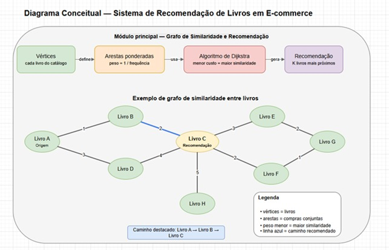

# E1 — Proposta e Definição do Projeto

> **Disciplina:** Teoria dos Grafos  
> **Prazo:** 19 de março de 2026  
> **Peso:** 10% da nota final  

---

## Identificação do Grupo

| Campo | Preenchimento |
|-------|---------------|
| Nome do projeto | Sistema de Recomendação de Livros baseado em Grafos de Similaridade |
| Integrante 1 | Gabriel Alves Dias Reis — 39840883 |
| Integrante 2 | Marcos Antônio da Silva Souza — 39815048 |
| Integrante 3 | Matheus Silva Soares — 38714663 |
| Domínio de aplicação | Comércio eletrônico (e-commerce) |

---

## 1. Contexto e Motivação

 
Diante da constante evolução da tecnologia, o mundo vem se tornando cada vez mais digitalizado, impulsionando o crescimento de diversos setores importantes para a sociedade. Entre eles, destaca-se o comércio eletrônico (e-commerce), que tem apresentado um crescimento expressivo em escala global, especialmente no setor de venda de livros digitais e físicos (RICCI; ROKACH; SHAPIRA, 2011). Esse avanço é resultado de diversos fatores, como a mudança no comportamento dos consumidores, maior segurança nos métodos de pagamento, melhorias logísticas e a ampla diversidade de livros disponíveis.
Nesse contexto, observa-se o uso crescente de algoritmos que auxiliam os usuários no processo de compra, além de contribuírem para a divulgação de livros. Plataformas como a Amazon utilizam sistemas de recomendação como principal estratégia para aumentar o engajamento dos usuários, sendo responsáveis por uma parcela significativa das vendas realizadas nessas plataformas. Os sistemas de recomendação surgem como uma solução importante, permitindo sugerir itens com base nos interesses e comportamentos dos usuários. No caso de livrarias digitais, esses sistemas ajudam a identificar livros relacionados a partir do histórico de compras conjuntas, facilitando a descoberta de novos títulos e aumentando o engajamento dos usuários (AGGARWAL, 2016).
Diante disso, torna-se relevante investigar formas eficientes de representar e processar as relações entre livros. O uso de grafos permite estruturar essas conexões de maneira clara, representando livros como vértices e suas relações como arestas, possibilitando a aplicação de algoritmos que identificam livros mais relevantes dentro de uma rede de similaridade (LEITE; CORTIMIGLIA; VECCHIA, 2018)

---

## 2. Objetivo Geral

Desenvolver um sistema de recomendação de livros para e-commerce utilizando grafos de similaridade, capaz de sugerir os livros mais relevantes a partir de um item selecionado pelo usuário.
---

## 3. Objetivos Específicos

- [X] Representar os livros do catálogo como vértices em um grafo a partir de um arquivo de dados (CSV ou similar)
- [X] Criar conexões entre os livros com base no histórico de compras conjuntas
- [X] Definir pesos nas arestas como medida de dissimilaridade (1/frequência)
- [X] Aplicar o algoritmo de Dijkstra para calcular os caminhos de menor custo entre os vértices 
- [X] Exibir os K livros mais próximos do item consultado como recomendações ao usuário

---

## 4. Público-Alvo / Caso de Uso Principal

O sistema é destinado a usuários de plataformas de e-commerce que desejam encontrar livros relacionados de forma rápida e eficiente. Também pode ser utilizado por empresas que buscam melhorar a experiência do usuário e aumentar a conversão de vendas. Um exemplo de uso ocorre quando um usuário visualiza ou compra um livro em uma loja virtual. A partir disso, o sistema recomenda itens semelhantes ou complementares, auxiliando na tomada de decisão e incentivando novas compras.

---

## 5. Justificativa Técnica — Por que Grafos?

A Teoria dos Grafos é adequada para este problema, pois permite representar livros como vértices e suas relações de compra conjunta como arestas, possibilitando modelar o comportamento dos usuários a partir do histórico de compras. O grafo utilizado é não-dirigido, já que a relação entre livros é bidirecional, e ponderado. Para garantir o uso correto do Algoritmo de Dijkstra, os pesos das arestas não representam diretamente a frequência de compras conjuntas, mas sim uma medida de dissimilaridade, definida como o inverso da frequência (peso = 1/frequência). Dessa forma, livros frequentemente comprados juntos possuem menor peso, permitindo que o algoritmo identifique caminhos de menor custo como sendo os mais relevantes. Essa abordagem resolve a relação entre similaridade e distância no grafo, tornando o modelo coerente com o funcionamento do algoritmo. Essa modelagem garante coerência entre a representação do problema e o funcionamento do algoritmo, permitindo identificar recomendações mais relevantes de forma eficiente. Além disso, a modelagem em grafos utilizando lista de adjacência é eficiente para grafos esparsos, comuns em sistemas de recomendação, apresentando complexidade aproximada de O((V+E) log V), sendo adequada para ambientes de e-commerce com grande volume de dados.
---

## 6. Tipo de Grafo

> Especifique as características do grafo que o problema requer.

| Característica | Escolha | Justificativa breve |
|----------------|---------|---------------------|
| Dirigido ou não-dirigido | Não-dirigido | Relações de similaridade entre produtos são bidirecionais |
| Ponderado ou não-ponderado |Ponderado | Os pesos representam a frequência de compras conjuntas |
| Conectado / bipartido / geral | Geral | Nem todos os produtos precisam estar conectados entre si |
| Representação interna pretendida | Lista de adjacência |Mais eficiente para grafos esparsos, pois em um catálogo com muitos livros cada item se conecta a poucos outros, resultando em E << V² |

---

## 7. Diagrama Conceitual

**Legenda:** 

Diagrama de recomendação de livros usando grafos, onde os livros são vértices e as conexões representam compras conjuntas. O algoritmo de Dijkstra identifica os livros mais próximos para recomendação.

## Checklist de Entrega

- [X] Texto entre 300 e 600 palavras (seções 1 a 5)
- [X] Todos os campos da tabela de identificação preenchidos
- [X] Tipo de grafo especificado com justificativa
- [X] Diagrama presente e referenciado no texto

*Teoria dos Grafos — Profa. Dra. Andréa Ono Sakai*
