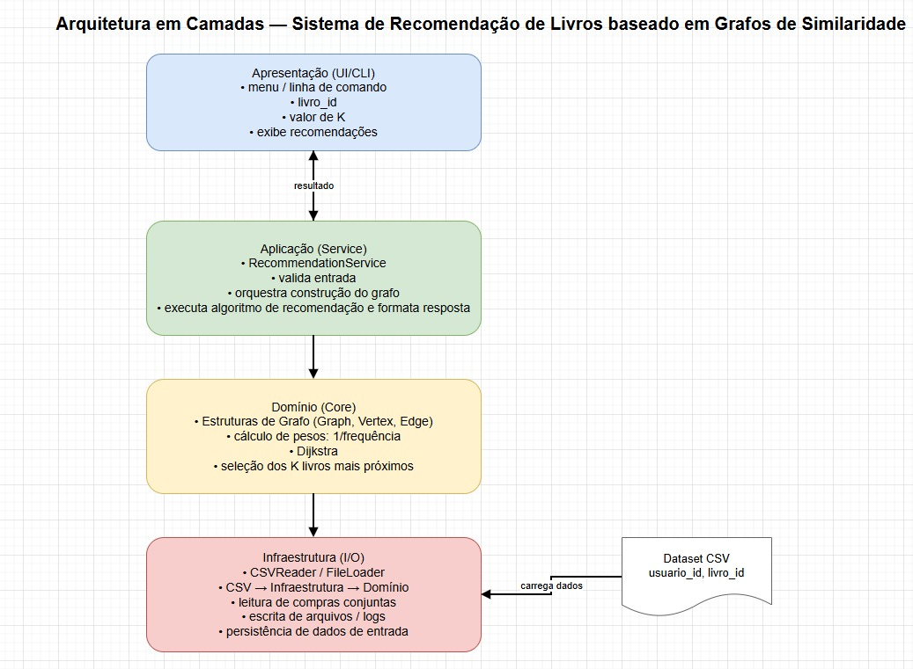

# E2 — Design Técnico, Arquitetura e Backlog

> **Disciplina:** Teoria dos Grafos  
> **Prazo:** 13 de abril de 2026  
> **Peso:** 20% da nota final  

---

## Identificação do Grupo

| Campo | Preenchimento |
|-------|---------------|
| Nome do projeto | Sistema de Recomendação de Livros baseado em Grafos de Similaridade |
| Repositório GitHub | https://github.com/MacQueenDev/Book-Nodes |
| Integrante 1 | Gabriel Alves Dias Reis - 39840883 |
| Integrante 2 | Marcos Antônio Da Silva Souza - 39815048 |
| Integrante 3 | Matheus Silva Soares - 38714663 |

---

## 1. Algoritmos Escolhidos

### 1.1 Algoritmo Principal

| Campo | Resposta |
|-------|----------|
| Nome do algoritmo | Algoritmo de Dijkstra |
| Categoria | guloso  |
| Complexidade de tempo | O((V + E) log V) |
| Complexidade de espaço | O(V) |
| Problema que resolve | O algoritmo de Dijkstra encontra os caminhos mínimos a partir de um vértice em grafos com pesos não negativos |

**Por que este algoritmo foi escolhido?**

O algoritmo de Dijkstra foi escolhido por ser adequado para encontrar caminhos de menor custo em grafos ponderados (DIJKSTRA, 1959). No sistema proposto, os livros são representados como vértices e as relações de compra conjunta como arestas. Para garantir a aplicação correta do algoritmo, os pesos das arestas são definidos como uma medida de dissimilaridade, dada por p = 1/frequência de compras conjuntas. Dessa forma, quanto maior a frequência com que dois livros são adquiridos juntos, menor será o peso da aresta que os conecta. Essa abordagem é coerente com aplicações de grafos em sistemas de recomendação, nos quais a proximidade entre itens pode ser modelada como uma distância no grafo (AGGARWAL, 2016). Assim, o algoritmo permite identificar os itens mais próximos ao vértice de origem, ou seja, aqueles com maior relação de similaridade. Consequentemente, torna-se possível gerar recomendações mais relevantes para o usuário, conforme discutido em sistemas de recomendação baseados em grafos (RICCI; ROKACH; SHAPIRA, 2011).

**Alternativa descartada e motivo:**

| Algoritmo alternativo | Motivo da exclusão |
|----------------------|-------------------|
| Busca em Largura (BFS) | A BFS não foi escolhida por não considerar pesos nas arestas, tratando todas as conexões igualmente. Já o Dijkstra permite considerar esses pesos, sendo mais adequado para encontrar caminhos mínimos com precisão. |

**Limitações no contexto do problema:**

O algoritmo de Dijkstra pode ter custo elevado em grafos muito grandes, impactando o desempenho. Além disso, não suporta pesos negativos e não encontra caminhos entre vértices desconectados, limitando recomendações para alguns livros.

**Referência bibliográfica:**

DIJKSTRA, Edsger W. A note on two problems in connexion with graphs. Numerische Mathematik, v. 1, p. 269–271, 1959.

AGGARWAL, Charu C. Recommender Systems: The Textbook. Cham: Springer, 2016.

RICCI, Francesco; ROKACH, Lior; SHAPIRA, Bracha. Recommender Systems Handbook. 2. ed. Boston: Springer, 2011.

---


## 2. Arquitetura em Camadas



### Descrição das camadas

| Camada | Responsabilidade | Artefatos principais |
|--------|-----------------|----------------------|
| Apresentação (UI/CLI) | Responsável pela interação com o usuário por meio da interface web, recebendo o livro de origem e o valor de K, além de exibir os resultados das recomendações. | Páginas HTML, formulários, rotas Flask de interface |
| Aplicação (Service) | Orquestra o fluxo do sistema, valida entradas e coordena a execução do algoritmo de recomendação. | Classe de serviço de recomendação (RecommendationService), validação de entrada, controle do fluxo |
| Domínio (Core) | Contém a lógica principal do sistema, incluindo a estrutura do grafo e a implementação do algoritmo de Dijkstra. | Classes Graph, Vertex e Edge, implementação do algoritmo de Dijkstra, cálculo de pesos (1/frequência) |
| Infraestrutura (I/O) | Responsável pela leitura dos dados de entrada e transformação em estruturas utilizáveis pelo sistema. | Leitura de arquivos CSV, parser de dados, carregamento das relações de compra |

---

## 3. Estrutura de Diretórios

```
Book-Nodes-main/
├── data/
│   ├── database.db
│   ├── testdata.py
│   └── dados.csv          
│
├── docs/
│   ├── desktop.ini
│   ├── E1_Grupo_15_Documento de Visão.md
│   ├── E2_Grupo_15_Designer_técnico.md
│   └── README.md
│
├── src/
│   ├── __pycache__/
│   │   ├── app.cpython-314.pyc
│   │   ├── engine.cpython-314.pyc
│   │   └── models.cpython-314.pyc
│   │
│   ├── templates/
│   │   ├── base.html
│   │   ├── detalhe.html
│   │   └── index.html
│   │
│   ├── app.py
│   ├── engine.py
│   ├── models.py
│   └── test.py
│
├── tests/
│   └── tests.py
│
├── LICENSE
├── requirements.txt
└── seed.py
```

> **Justificativa de desvios** *(se houver)*: Eventuais ajustes podem ser realizados ao longo do desenvolvimento do projeto, visando melhorias na estrutura e na implementação do sistema.


## 4. Definição do Dataset

**Formato de entrada aceito:**

O sistema utilizará arquivos CSV como formato principal de entrada, pois são adequados para representar dados de compras de forma simples e organizada. A partir dessas informações, serão identificadas as relações entre os livros e construído um grafo de similaridade. Esse grafo será representado por meio de lista de adjacência, que é uma estrutura eficiente para grafos esparsos e contribui para um melhor desempenho na execução do algoritmo de Dijkstra.

**Exemplo de estrutura do arquivo de entrada:**

```CSV
origem,destino,peso
Livro A,Livro B,0.2
Livro A,Livro C,0.5
Livro B,Livro C,0.25
Livro B,Livro D,0.1
Livro C,Livro D,0.33
Livro D,Livro E,0.2
Livro E,Livro A,0.4

```

**Estratégia de geração aleatória:**

| Parâmetro | Descrição |
|-----------|-----------|
| Número de vértices | Definido via argumento, permitindo variar o tamanho do grafo |
| Densidade | Valor entre 0.0 e 1.0 que controla a quantidade de arestas |
| Faixa de pesos | Valores mínimo e máximo configuráveis para os pesos das arestas |

---

## 5. Backlog do Projeto

### 5.1 In-Scope — O que será implementado

| # | Funcionalidade | Prioridade | Critério de aceite |
|---|---------------|------------|-------------------|
| 1 | Leitura do dataset CSV | Alta  | Dado um arquivo CSV com usuários e livros, quando o sistema for executado, então os dados devem ser carregados corretamente|
| 2 | Construção do grafo de similaridade |Alta |Dado o dataset carregado, quando o sistema processar as compras, então deve ser criado um grafo com vértices e arestas de co-compra |
| 3 |Cálculo dos pesos das arestas (1/frequência) | Alta | Dado um par de livros comprados juntos, quando o sistema calcular o peso, então o valor deve ser igual a 1 dividido pela frequência|
| 4 |Execução do algoritmo de Dijkstra |Alta |Dado um livro de origem, quando o algoritmo for executado, então os menores caminhos para os demais vértices devem ser calculados corretamente |
| 5 |Geração de recomendações (Top K livros) |Alta |Dado um livro de origem e um valor K, quando o sistema gerar recomendações, então devem ser retornados os K livros mais próximos |
| 6 |Interface web com Flask |Média |Dado que o sistema está em execução, quando o usuário acessar a aplicação web e selecionar um livro, então as recomendações devem ser exibidas na interface |

### 5.2 Out-of-Scope — O que NÃO será feito

| Funcionalidade excluída | Motivo |
|------------------------|--------|
|Uso de algoritmos de Machine Learning |O foco do projeto é a aplicação de algoritmos de grafos |
|Uso de sistemas de banco de dados complexos (MySQL, PostgreSQL)|Será utilizado CSV e, opcionalmente, SQLite para simplificar a implementação|
|Sistema distribuído ou em tempo real |O projeto é acadêmico e não requer alta escalabilidade |

---

## Checklist de Entrega

- [X] Big-O de tempo e espaço declarados para cada algoritmo
- [X] Ao menos 1 alternativa descartada com justificativa
- [X] Diagrama de arquitetura com 4 camadas identificadas
- [X] Referência bibliográfica para cada algoritmo (ABNT ou IEEE)
- [X] Backlog com ≥ 5 itens In-Scope e ≥ 3 Out-of-Scope
- [X] Ao menos 3 critérios de aceite no formato "dado / quando / então"
- [X] Exemplo de estrutura de arquivo de entrada presente

---

*Teoria dos Grafos — Profa. Dra. Andréa Ono Sakai*
