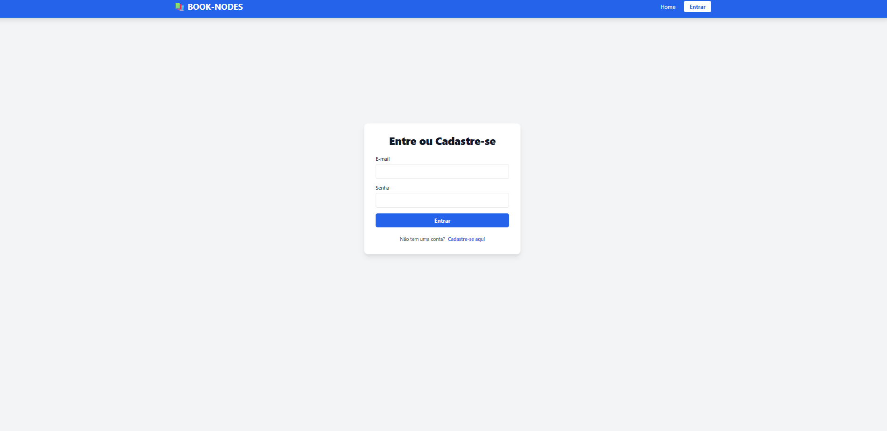
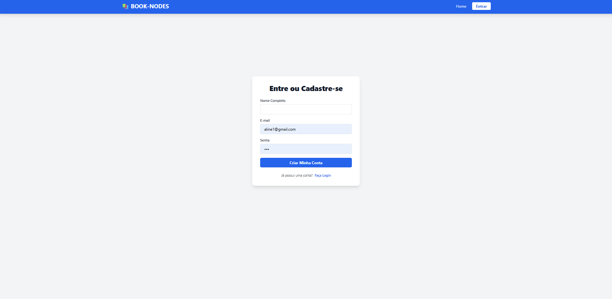
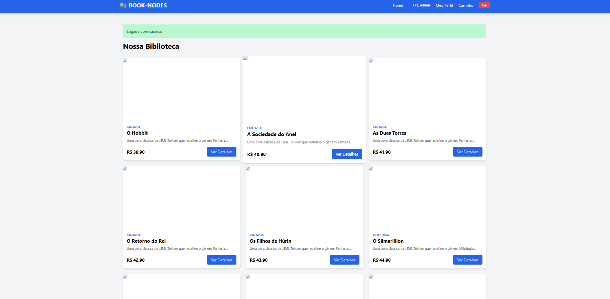
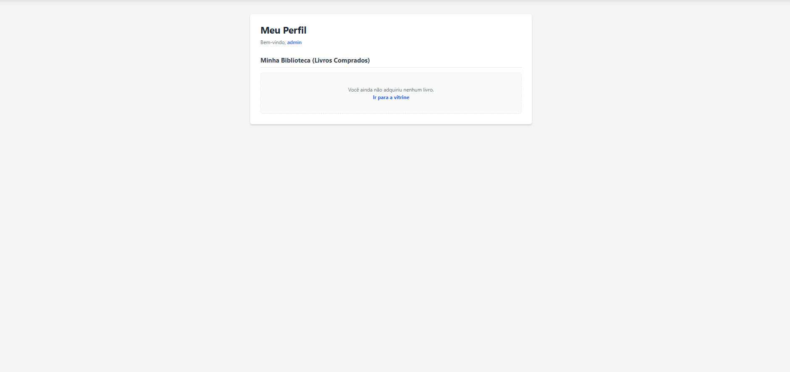
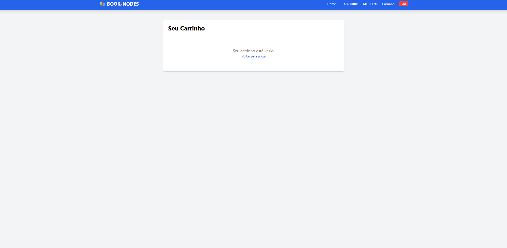

# E3 — MVP: Núcleo Funcional com Primeiras Telas

> **Disciplina:** Teoria dos Grafos  
> **Prazo:** 10 de maio de 2026  
> **Peso:** 25% da nota final  

---

## Identificação do Grupo

| Campo | Preenchimento |
|-------|---------------|
| Nome do projeto | Sistema de Recomendação de Livros baseado em Grafos de Similaridade |
| Repositório GitHub | https://github.com/MacQueenDev/Book-Nodes |
| Integrante 1 | Gabriel Alves Dias Reis - 39840883  |
| Integrante 2 | Marcos Antônio Da Silva Souza - 39815048 |
| Integrante 3 | Matheus Silva Soares - 38714663 |

---

## 1. Como Executar o MVP

> Instrua como rodar o projeto do zero. Alguém que nunca viu o código deve conseguir executar seguindo estas instruções.

**Pré-requisitos:**

```bash
## 1. Como Executar o MVP

```bash
- Python 3.10+
- pip instalado

**Instalação:**

```bash
git clone https://github.com/MacQueenDev/Book-Nodes
cd Book-Nodes

pip install -r requirements.txt
pip install Flask-Login
```

**Execução:**

```bash
# Comando para rodar o MVP

python seed.py
python src/app.py
```

**Saída esperada:**

```
O sistema inicia uma aplicação web utilizando Flask. O usuário pode selecionar um livro e visualizar recomendações geradas a partir do algoritmo de Dijkstra, com base nas relações de similaridade entre os livros.
```

---

## 2. Algoritmo Implementado

| Campo | Resposta |
|-------|----------|
| Nome do algoritmo | Dijkstra |
| Arquivo de implementação | src/engine.py |
| Complexidade de tempo |  O(V² + E) |
| Complexidade de espaço |  O(V + E) |

**Trecho do código com comentário de Big-O:**


```python
from models import Conexao

def obter_recomendacoes(livro_id_inicial):
    # Busca todas as conexões entre livros no banco de dados.
    # Considerando E conexões/arestas, esta etapa possui custo O(E).
    conexoes = Conexao.query.all()

    # O grafo é representado por lista de adjacência usando dicionários.
    # O espaço ocupado será O(V + E), onde V é o número de livros/vértices
    # e E é o número de conexões/arestas.
    grafo = {}

    # Construção do grafo não direcionado.
    # Cada conexão é inserida nos dois sentidos.
    # Complexidade: O(E).
    for c in conexoes:
        if c.livro_id_1 not in grafo:
            grafo[c.livro_id_1] = {}

        if c.livro_id_2 not in grafo:
            grafo[c.livro_id_2] = {}

        grafo[c.livro_id_1][c.livro_id_2] = c.peso
        grafo[c.livro_id_2][c.livro_id_1] = c.peso

    # Caso o livro inicial não possua conexões no grafo,
    # não há recomendações possíveis.
    # Complexidade: O(1).
    if livro_id_inicial not in grafo:
        return []

    # Inicialização das distâncias.
    # Todos os livros começam com distância infinita,
    # exceto o livro inicial, que recebe distância 0.
    # Complexidade: O(V).
    distancias = {no: float('infinity') for no in grafo}
    distancias[livro_id_inicial] = 0

    # Conjunto utilizado para armazenar os vértices já visitados.
    # Espaço: O(V).
    visitados = set()

    # Algoritmo de Dijkstra sem fila de prioridade.
    # O laço principal pode executar até V vezes.
    # Como a escolha do menor vértice é feita percorrendo todos os nós,
    # essa etapa possui custo O(V²).
    while len(visitados) < len(grafo):
        no_atual = None

        # Busca o nó ainda não visitado com a menor distância conhecida.
        # Complexidade: O(V) a cada iteração.
        for no in grafo:
            if no not in visitados:
                if no_atual is None or distancias[no] < distancias[no_atual]:
                    no_atual = no

        # Se não houver nó alcançável restante, o algoritmo é encerrado.
        # Complexidade: O(1).
        if no_atual is None or distancias[no_atual] == float('infinity'):
            break

        visitados.add(no_atual)

        # Relaxamento das arestas do nó atual.
        # Ao longo de toda a execução, cada aresta é analisada.
        # Complexidade total desta parte: O(E).
        for vizinho, peso in grafo[no_atual].items():
            nova_distancia = distancias[no_atual] + peso

            if nova_distancia < distancias[vizinho]:
                distancias[vizinho] = nova_distancia

    # Ordena os livros pela menor distância em relação ao livro inicial.
    # Complexidade: O(V log V).
    recomendados_ordenados = sorted(distancias, key=distancias.get)

    # Retorna os 5 livros mais próximos, removendo o próprio livro inicial.
    # Complexidade: O(V), por percorrer a lista ordenada.
    return [id for id in recomendados_ordenados if id != livro_id_inicial][:5]

---

O algoritmo implementado é o **Dijkstra**, utilizado para encontrar os livros mais próximos de um livro inicial em um grafo ponderado. Cada livro representa um vértice, e cada conexão entre livros representa uma aresta com peso. Quanto menor a distância acumulada entre dois livros, maior a similaridade entre eles para fins de recomendação. A implementação utiliza uma lista de adjacência com dicionários e não utiliza fila de prioridade. Por isso, a escolha do próximo nó com menor distância é feita por busca linear, resultando em complexidade de tempo **O(V² + E)**. A complexidade de espaço é **O(V + E)**, pois são armazenados o grafo, as distâncias e os nós visitados.

## 3. Estrutura do Repositório

> Confirme que a estrutura implementada está de acordo com o E2.

```
BOOK-NODES/
│
├── data/
│   ├── database.db
│   ├── grafo_conexoes.csv
│   └── testdata.py
│
├── docs/
│   ├── img/
│   │   ├── cadastrar.png
│   │   ├── Carrinho.png
│   │   ├── diagrama1.jpeg
│   │   ├── diagramaarquitetura.jpeg
│   │   ├── Home.png
│   │   ├── login.png
│   │   ├── logo.png
│   │   └── Perfil.png
│   │
│   ├── E1_Grupo15_Documento de Visão (1).md
│   ├── E2_Grupo15_Designer_técnico.md
│   ├── E3_Book-Nodes.md
│   └── README.md
│
├── src/
│   ├── templates/
│   │   ├── base.html
│   │   ├── carrinho.html
│   │   ├── detalhe.html
│   │   ├── index.html
│   │   ├── login.html
│   │   └── perfil.html
│   │
│   ├── app.py
│   ├── engine.py
│   ├── models.py
│   └── test.py
│
├── tests/
│   └── test_engine.py
│
├── LICENSE
├── requirements.txt
└── seed.py
```

**Desvios em relação ao E2** *(se houver)*: A estrutura segue o planejado no E2, com adaptação para aplicação web utilizando Flask.

---

## 4. Telas do MVP

### Tela de Entrada



*Descrição:*

A tela de entrada apresenta a página de login do sistema **BOOK-NODES**. Nela, o usuário pode informar seu e-mail e senha para acessar a plataforma. Também há um link para cadastro de novos usuários, permitindo que pessoas sem conta possam se registrar no sistema.

### Tela de Cadastro



*Descrição:*

A tela de cadastro permite que um novo usuário crie uma conta no sistema **BOOK-NODES**. Nela, o usuário informa nome completo, e-mail e senha. Após preencher os dados, é possível clicar no botão “Criar Minha Conta” para realizar o cadastro. A tela também possui um link para login, caso o usuário já tenha uma conta cadastrada.

### Tela de Resultado



*Descrição:*

Após realizar o login com sucesso, o usuário é redirecionado para a tela principal da aplicação, onde é exibida a biblioteca de livros disponíveis. A tela mostra cards com informações dos livros, como categoria, título, descrição resumida, preço e botão de detalhes. Também é possível acessar o perfil do usuário, o carrinho e realizar logout pelo menu superior.

### Tela de Perfil



*Descrição:*  

A tela de perfil exibe as informações do usuário logado e a seção “Minha Biblioteca”, onde aparecem os livros comprados. Caso o usuário ainda não tenha adquirido nenhum livro, o sistema apresenta uma mensagem informando que não há livros comprados e disponibiliza um link para retornar à vitrine.

### Tela do Carrinho



*Descrição:*  

A tela do carrinho apresenta os livros adicionados para compra. Quando não há nenhum item no carrinho, o sistema exibe a mensagem “Seu carrinho está vazio” e disponibiliza um link para o usuário voltar à loja.


---

## 5. Testes Unitários

| Algoritmo | Caso de teste | Status | Comando para executar |
|-----------|--------------|--------|----------------------|
| Dijkstra | Caso base | ✅ | `pytest tests/test_engine.py::test_dijkstra_caso_base` |
| Dijkstra | Grafo vazio | ✅  | `pytest tests/test_engine.py::test_dijkstra_grafo_vazio` |
| Dijkstra | Grafo completo | ✅  | `pytest tests/test_engine.py::test_dijkstra_grafo_completo` |

**Como rodar todos os testes:**

```bash
Rodar cada um separadamente:
Caso base: pytest tests/test_engine.py::test_dijkstra_caso_base
Grafo vazio: pytest tests/test_engine.py::test_dijkstra_grafo_vazio
Grafo completo: pytest tests/test_engine.py::test_dijkstra_grafo_completo

Rodar todos juntos:
pytest tests/test_engine.py
```

**Resultado atual:**

```
(.venv) PS C:\Users\PLANNIX-TRABALHO\Book-Nodes> pytest tests/test_engine.py                                                                                                             
================================================================================================== test session starts ===================================================================================================
platform win32 -- Python 3.14.4, pytest-9.0.3, pluggy-1.6.0
rootdir: C:\Users\PLANNIX-TRABALHO\Book-Nodes
collected 3 items                                                                                                                                                                                                         

tests\test_engine.py ...                                                                                                                                                                                            [100%]

=================================================================================================== 3 passed in 0.38s ====================================================================================================

```

---

## 6. Histórico de Commits

> Liste os 5+ commits mais relevantes desta entrega.

| Hash (7 chars) | Mensagem | Autor |
|----------------|----------|-------|
| `cc33eca` | Estrutura inicial: Flask + SQLite + Motor Dijkstra | Marcos |
| `a409112` | Correção de alguns bugs + primeira versão do front-end (1.0) | Marcos |
| `b23c416` | feat: adicionou 85 livros pra teste, manual do motor sem biblioteca | Marcos |
| `8ec8ca9` | Feat: novas telas funcionais + sistema de usuário | Marcos |
| `60e7596` | docs: atualizações de documentação e imagens | Matheus |
| `9f120b0` | Adicione o algoritmo de Dijkstra para recomendações de livros | Gabriel Reis |
| `353a103` | test: finaliza testes unitários e documentação do MVP | Matheus |


---

## 7. O que está funcionando / O que ainda falta

| Funcionalidade | Status | Observação |
|---------------|--------|------------|
| Classe do grafo | ✅ Completo | O sistema modela os livros como vértices e as conexões entre livros como arestas ponderadas. |
| Algoritmo principal | ✅ Completo | O algoritmo de Dijkstra foi implementado para gerar recomendações com base nas menores distâncias entre livros relacionados. |
| Leitura de arquivo | ✅ Completo |O projeto utiliza SQLite como fonte principal de dados. O banco é populado pelo `seed.py` com os livros e as conexões ponderadas do grafo. Além disso, foi gerado o arquivo `data/grafo_conexoes.csv`, que documenta as arestas do grafo com os livros conectados e seus respectivos pesos. |
| Tela de entrada | ✅ Completo | A tela de login está funcionando e permite o acesso de usuários cadastrados. |
| Tela de cadastro | ✅ Completo | A tela permite criar uma nova conta informando nome, e-mail e senha. |
| Tela de resultado | ✅ Completo | A vitrine principal exibe os livros disponíveis em cards com título, categoria, descrição, preço e botão de detalhes. |
| Tela de perfil | ✅ Completo | A tela de perfil mostra o usuário logado e a biblioteca de livros comprados. |
| Tela do carrinho | ✅ Completo | A tela do carrinho está implementada e exibe mensagem quando não há itens adicionados. |
| Testes unitários | ✅ Completo |  Foram implementados 3 testes unitários para o algoritmo de Dijkstra: caso base, grafo vazio e grafo completo. Todos foram executados com `pytest`. |
---

## Checklist de Entrega

- [x] Repositório público e acessível
- [x] .gitignore configurado
- [x] README com instruções de execução do MVP
- [x] Algoritmo principal executando sem erros
- [x] Tela de entrada e tela de resultado demonstráveis
- [x] 3 testes unitários por algoritmo (mínimo caso base passando)
- [x] ≥ 5 commits com prefixos semânticos (feat:, fix:, test:, docs:)
- [x] Ao menos 1 arquivo de grafo de exemplo em `data/`

---

*Teoria dos Grafos — Profa. Dra. Andréa Ono Sakai*
